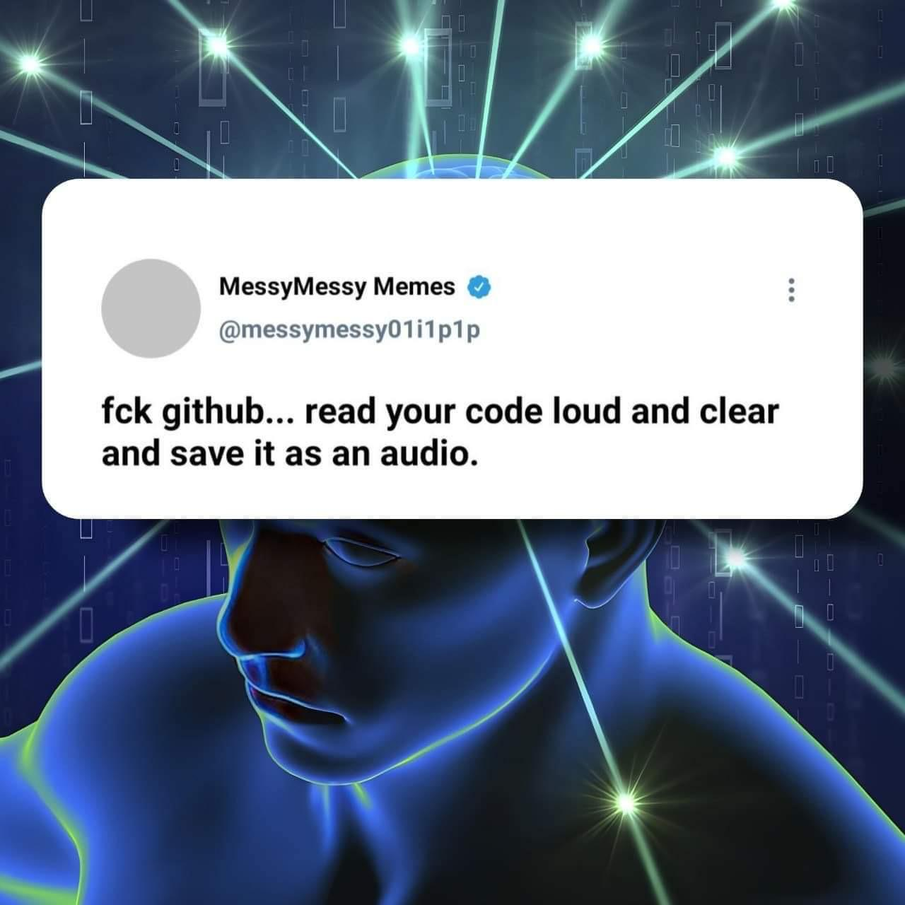

# Watchable Audible Code Kiosk (WACK)

This is a project that will revolustionize the software development industry. While git is a fantatic tool for version controll, many programmers do not use git as a version control software, rather just a storage and backup of code on GitHub. This wastes space on their servers. But who does have unlimited storage? Google! More specifically, YouTube, which lets you host videos of almost unlimited length! That is where we come in. The code in this repository will (eventully) make it super simple for you to encode your own code-projects in ASCII, converted to a .WAV-file, which is stored in video-format on YouTube, for your convenience!

Switching to our services wil revolutionize the way you backup code. Uploading is idiotically simple. With the API we provide, converting your project to audible file takes only a few seconds, and is then automagically uploaded to YouTube (coming soon). Getting your code back is just as simple, and no bytes are lost in compression. The great advantage of using our services is that when your are bored, you can watch your own code play on a screen. You can also pay $1, and we will add a soundtrack of your choice. This has the potential to give the ultimate visual and audible ASMR-experience. While we offer no guarantees, good programmers might even earn a few buck from ad-revenue! Start using WACK-backups today.

## Installation:
For this code to work, you need to install rust and opencv. You can use the commands below. Then clone this repo and you're good to go.

[Rust](https://www.rust-lang.org/tools/install)

[opencv](https://github.com/twistedfall/opencv-rust)

### Quick commands:

`curl --proto '=https' --tlsv1.2 -sSf https://sh.rustup.rs | sh`

`sudo apt install libopencv-dev clang libclang-dev libstdc++-12-dev`

## Usage:

At the moment, this only works for a single python-file. To encrypt this file, place it in this directory. Then run `python main.py NAME.py`. This will turn your code into a video. WARNING: The original file will be gone. To retrieve it, run `python main.py NAME.avi`. This will re-convert the video to the original file, and also execute the script.

## Inspirations:

[This video](https://www.youtube.com/watch?v=8I4fd_Sap-g)

## TODO-list:
- [x] convert files to audio files
- [x] Convert audio files to video files
- [ ] upload to YouTube
- [ ] Earn ad-revenue
- [ ] eat pizza
- [ ] Download video from YouTube
- [x] Convert video file to audio file
- [x] Convert audio file to code
- [ ] make it possible to encode entire directory, not just single python files
- [ ] Make runnable from anywhere
- [x] laugh at stupidity of project 
- [ ] Du actually useful stuff, like applying to jobs

## Acknowledgements

This project relies heavily on the work of [DvorakDwarf on GitHub](https://github.com/DvorakDwarf/Infinite-Storage-Glitch). I only converts the file to audio, their code does the video thing.

