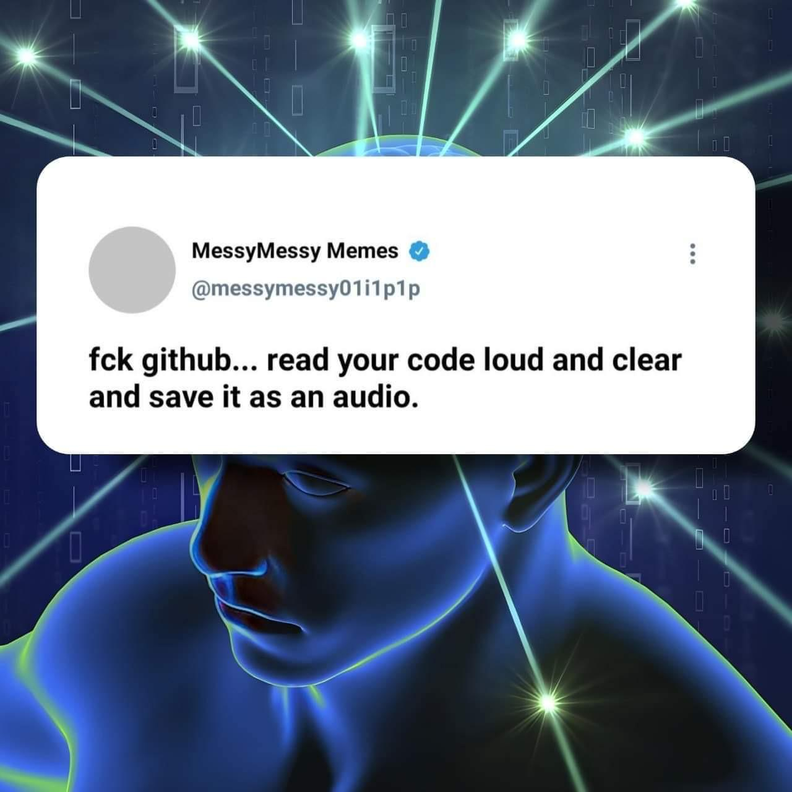

# Watchable Audible Code Kiosk (WACK)

This is a project that will revolustionize the software development industry. While git is a fantatic tool for version controll, many programmers do not use git as a version control software, rather just a storage and backup of code on GitHub. This wastes space on their servers. But who does have unlimited storage? Google! More specifically, YouTube, which lets you host videos of almost unlimited length! That is where we come in. The code in this repository will (eventully) make it super simple for you to encode your own code-projects in ASCII, converted to a .WAV-file, which is stored in video-format on YouTube, for your convenience!

Switching to our method wil revolutionize the way you backup code. Uploading is idiotically simple. With the API we provide, converting your project to audible file takes only a few seconds per charater, and is then automagically uploaded to YouTube. Getting your code back is just as simple, and no bytes are lost in compression. The great advantage of using our services is that when your are bored, you can watch your own code play on a screen. You can also pay $1, and we will add a soundtrack of your choice. This has the potential to give the ultimate visual and audible ASMR-expierence. While we offer no guarantees, good programmers might even earn a few buck from ad-revenue! Start using WACK-backups today.

## Inspirations:

[This video](https://www.youtube.com/watch?v=8I4fd_Sap-g)

